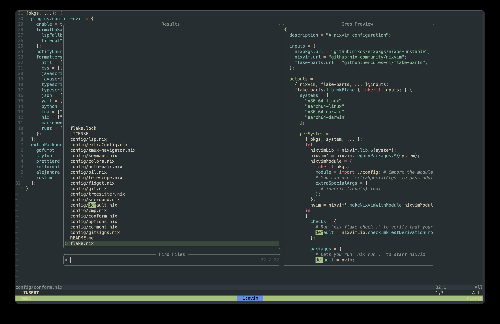

# nix-emvim

## Setup



## Plugins

See [./config/default.nix](./config/default.nix) file.

## Configuring

To start configuring, just add or modify the nix files in `./config`.
If you add a new configuration file, remember to add it to the
[`config/default.nix`](./config/default.nix) file

## Running

```
nix run github:emptii/nix-emvim
```

## Credits

See [nixvim](https://github.com/nix-community/nixvim) and [panda-nix-vim](https://github.com/pandalanax/nix-pandavim).
